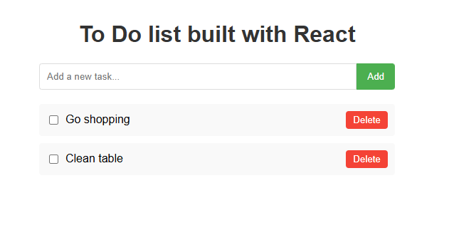

# React Todo List Application

A simple, responsive todo list application built with React.

## Features

- Add new tasks to your list
- Mark tasks as complete/incomplete
- Delete tasks when no longer needed
- Responsive design - works on desktop and mobile
- Data persists in local storage - your tasks remain saved even after closing the browser

## Installation

```bash
# Clone the repository (if applicable)
git clone https://github.com/OmBiradar/react-to-do.git

# Navigate to the project directory
cd react-to-do

# Install dependencies
npm install

# Start the development server
npm start
```

The application will open in your browser at [http://localhost:3000](http://localhost:3000).

## Tech Stack

- React 19.1.0
- CSS for styling
- Local Storage for data persistence

## Usage



1. Enter a task in the input field
2. Click "Add" or press Enter to add it to your list
3. Check the checkbox to mark a task as complete
4. Click the "Delete" button to remove a task

## License

This project is open source and available under the [MIT License](LICENSE).
